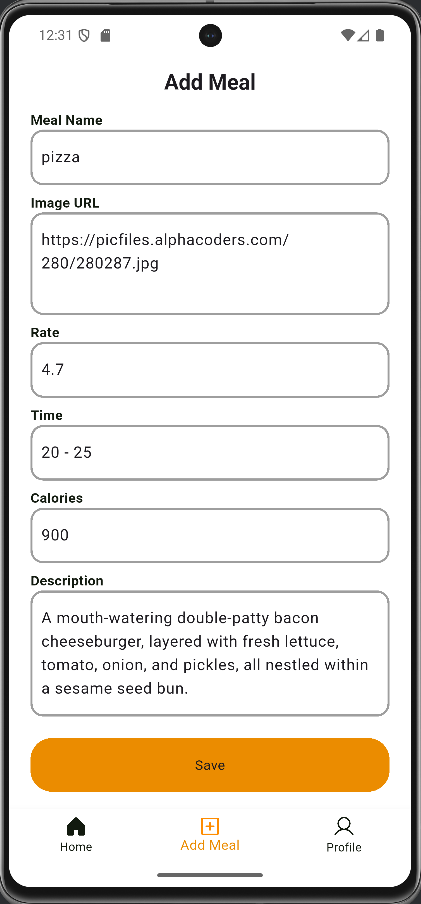
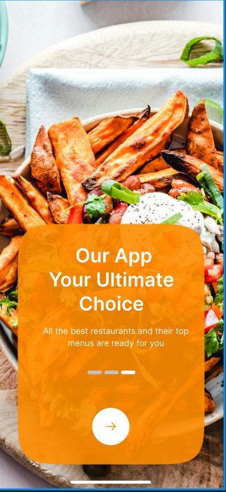
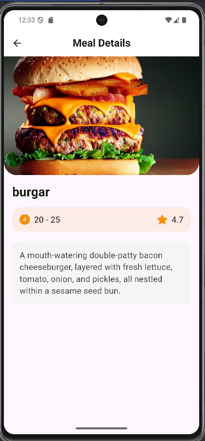
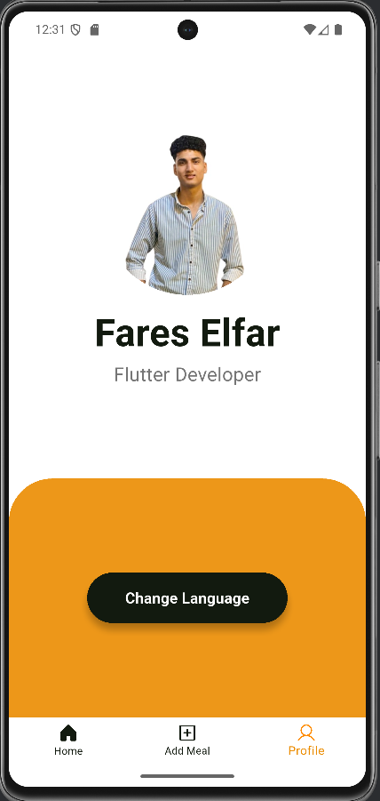

# 🍽️ Meals App

A modern **Flutter application** to explore and manage meals easily.  
The app supports **multi-language (English/Arabic)** 🌍, **responsive design** 📱, and a built-in **local database** 💾 for offline support.

---

## 🚀 Features
- 📱 **Clean & Responsive UI** with `flutter_screenutil`
- 🌍 **Multi-language support** (English & Arabic) using `easy_localization`
- 🖼️ **Optimized Images** with `cached_network_image`
- ⭐ **Meal details** (time, rating, description)
- 💾 **Local Database** using `sqflite` to store meals
- 🧩 **Shared Preferences** for saving lightweight user data
- 🎬 **Lottie Animations** for smooth user experience
- 🎠 **Carousel Slider + Dots Indicator** for onboarding
- 🎨 **SVG Icons** support with `flutter_svg`

---

## 🛠️ Tech Stack
- **Flutter** & **Dart**
- **State Persistence:** `shared_preferences`
- **Database:** `sqflite` + `path`
- **Responsive UI:** `flutter_screenutil`
- **Localization:** `easy_localization`
- **UI Enhancements:** `carousel_slider`, `dots_indicator`, `lottie`, `flutter_svg`
- **Images:** `cached_network_image`

---

## 📸 Screenshots
| Add Meal Screen | Onboarding | Home Layout |
|---------------|------------|-------------|
|  |  |  |

| Meal Details | Profile Screen |
|--------------|----------------|
|  |  |

---

## 📂 Project Structure

lib/

├── core/ # Colors, constants, themes

├── data/ # Models & local database

├── screens/ # Screens (Splash, Onboarding, Home, Details, Profile...)

├── widgets/ # Reusable widgets

└── main.dart # App entry point

---

## ▶️ Getting Started

### 1️⃣ Clone the repository
```bash
git clone https://github.com/alfar02/meals_app.git
cd meals_app

### 2️⃣ Install dependencies
```bash
flutter pub get

### 2️⃣ Run the app
```bash
flutter run


---

### Author

Fares Elfar
Flutter Developer passionate about building impactful mobile applications 🚀

- 💼 [LinkedIn](https://www.linkedin.com/in/fareselfar)
- 🐙 [GitHub](https://github.com/alfar02)
- ✉️ Email: **fareselfar74@gmail.com**


